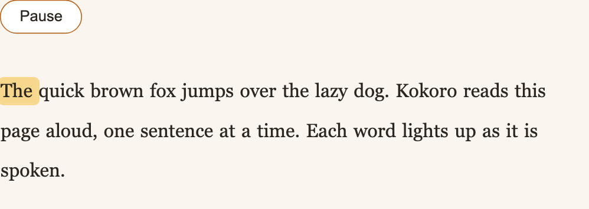
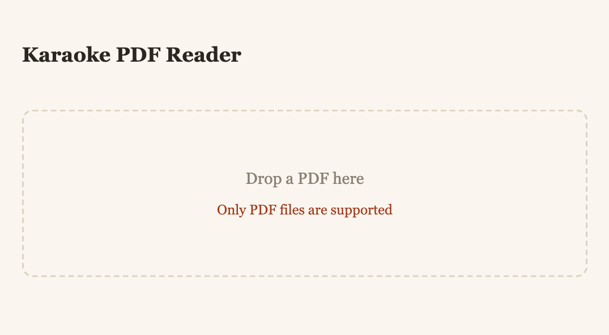
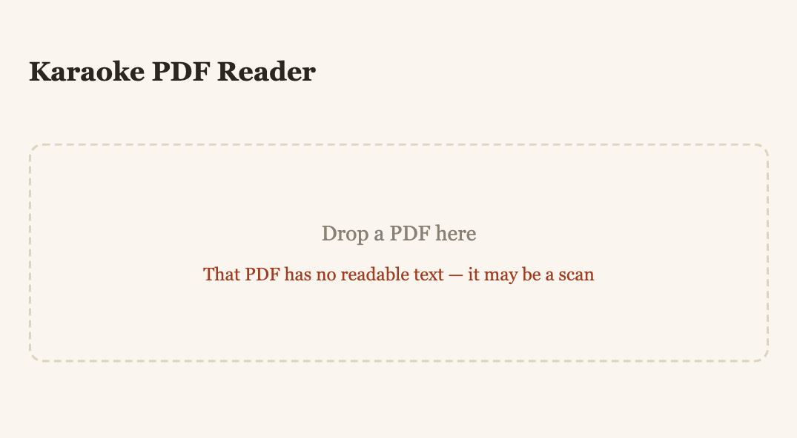
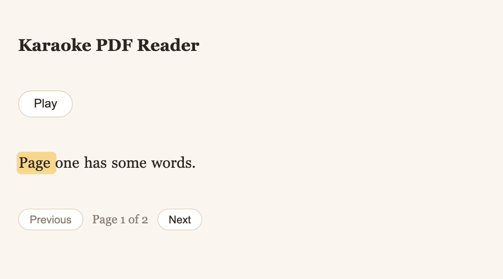

# The interface, screen by screen

Every image on this page is written by a passing test. If the interface changes
and these images do not, a test failed — see
[ADR 0004](../explanation/adr/0004-documentation-images-are-test-output.md).

Regenerate them with `make test-e2e`.

## The reading loop

## Before a document is loaded

A single drop target. There is nothing else to configure — no voice picker, no
settings, no account.

| Hook | |
|---|---|
| `[data-testid="drop-zone"]` | the drop target |
| `[data-dragging]` | `"true"` while a file is held over it |
| `input[type="file"]` | visually hidden, but focusable — the keyboard path to the same thing |

Dropping anything that is not a PDF leaves the drop zone usable and announces
the problem through `role="alert"`, so a screen reader hears it:

> Only PDF files are supported

A PDF that *is* a PDF but carries no text — a scan, which is an image of a page
rather than words — gets its own message, because the alternative is a blank
page and a play button that does nothing:

> That PDF has no readable text — it may be a scan

Only a document with no text on *any* page is refused. A blank cover page is
ordinary and does not count — there is a test holding that line.

## After a PDF is dropped

The words appear immediately — extraction is fast. Narration is still being
synthesised at this point, so the play button is disabled and the status line
reads **Preparing narration…**.

| Hook | |
|---|---|
| `[data-testid="page-view"]` | the reading area |
| `[data-testid="status"]` | `""`, `"Uploading…"`, or `"Preparing narration…"` |
| `[data-testid="play-button"]` | disabled until the timeline has arrived |

## While reading

Exactly one word carries `data-active="true"` at any instant. That is not a
convention the interface tries to maintain — it follows from the timeline
covering the audio with no gaps and no overlaps, which is
[proved as a property](behaviours.md).

| Hook | |
|---|---|
| `[data-word-index="n"]` | the nth word of the page, in reading order |
| `[data-active="true"]` | the word currently being spoken — never more than one |

The highlight is driven from `audio.currentTime` through `activeIndex()`, on a
`requestAnimationFrame` loop. Nothing is pushed from the server; the audio
element is the clock.

## Clicking a word

Clicking any word moves the narration to it and carries on from there.

!!! note "This needs byte ranges"
    Seeking a media element requires the server to answer byte-range requests.
    Without them `audio.seekable` is `[0, 0]` and assigning `currentTime` does
    nothing at all — silently. See [HTTP API](http-api.md#get-apidocumentsidpagesnaudiowav).

## Moving between pages

A document of more than one page gets a control bar under the text. Moving to
another page fetches that page's narration, so the play button goes disabled
and comes back when the new page is ready.

| Hook | |
|---|---|
| `[data-testid="page-controls"]` | the bar — **absent entirely** for a one-page document |
| `[data-testid="next-page"]` / `[data-testid="previous-page"]` | disabled at the last and first page respectively |

The position reads `Page 1 of 2`, counting from one. It carries no test hook on
purpose: the tests assert the visible text, which is what a reader actually
sees and survives any change to the markup around it.

Going back re-narrates the page you return to rather than replaying what was
already loaded — the words and the audio always describe the same page.

!!! note "The indicator counts from one, the API counts from zero"
    *Page 1 of 2* is `pages/0` over HTTP. People number pages from one; the API
    indexes from zero. See [HTTP API](http-api.md#get-apidocumentsidpagesnnarration).
