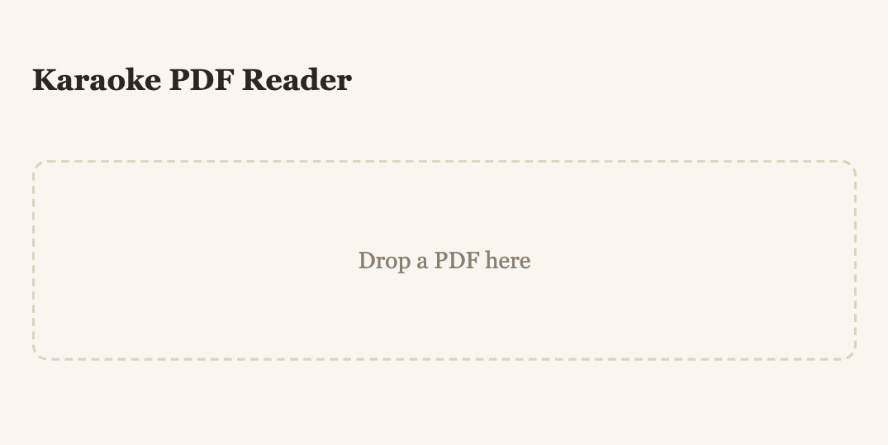
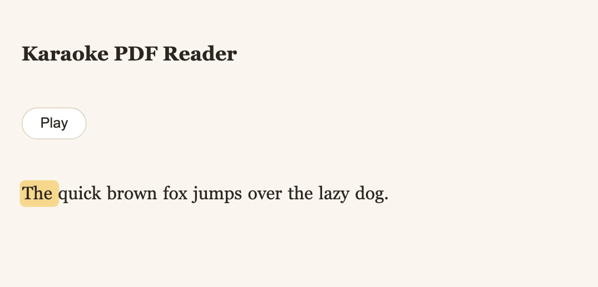
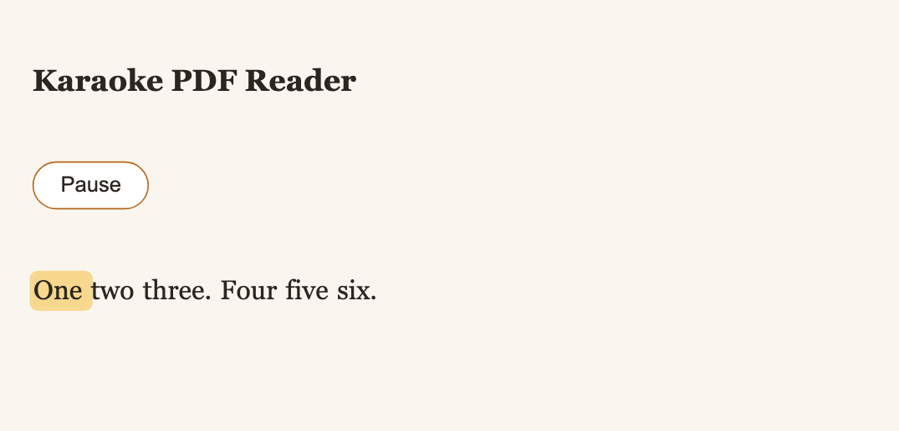
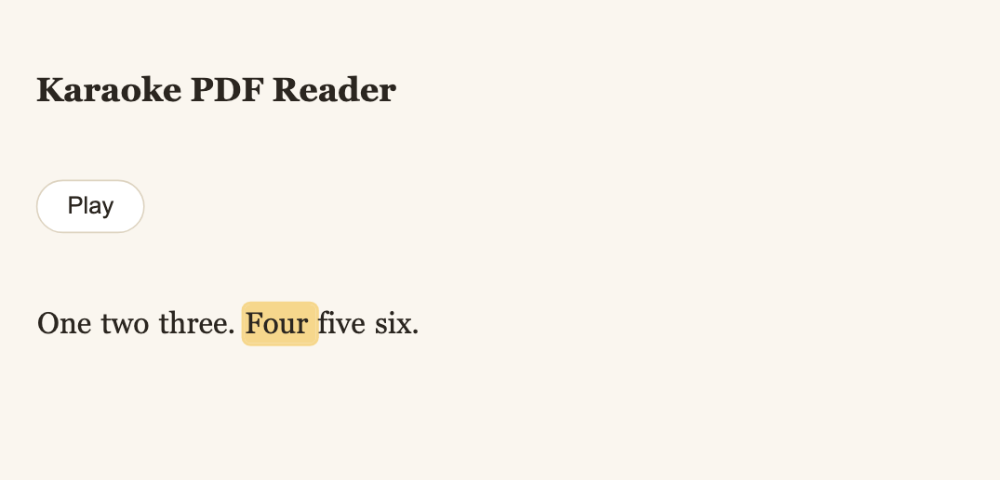
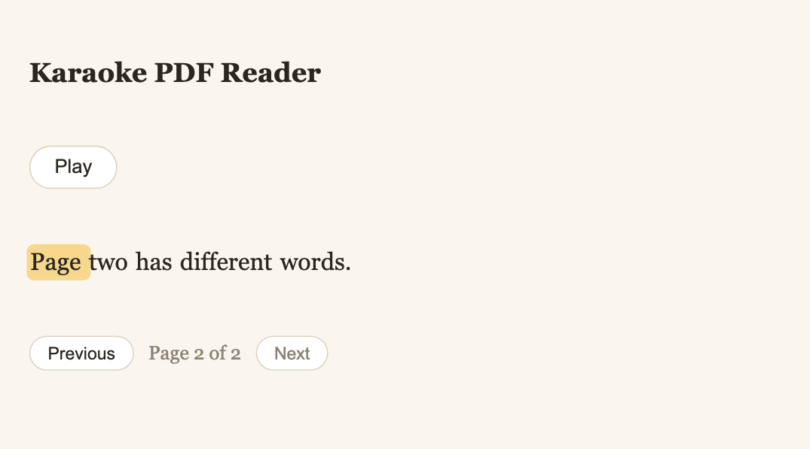

# Read your first PDF aloud

By the end of this you will have the reader running on your own machine and will
have heard it read a page to you, with the words lighting up as they are spoken.

Budget about ten minutes. Most of that is a one-time model download.

## Before you start

You need [uv](https://docs.astral.sh/uv/), [pnpm](https://pnpm.io/), and Node 22.13
or newer. Check:

```bash
uv --version
node --version
```

!!! warning "If `node --version` prints something older than 22.13"
    pnpm 11 refuses to run on it. If you have Node installed through Homebrew,
    the newer one is usually already there:

    ```bash
    export PATH=/opt/homebrew/opt/node/bin:$PATH
    ```

    The `Makefile` does this for you; you only need it for direct `pnpm` calls.

## Step 1 — Install

```bash
make install
```

This installs the Python side with uv, the web app with pnpm, and a Chromium
build for the browser tests. It also pulls the Kokoro model — around 235 MB, and
the slowest part of this tutorial.

## Step 2 — Start it

```bash
make dev
```

Two things start: the API on port 8000 and the web app on port 5173. Open
<http://localhost:5173>.

You should see an empty page with a dashed rectangle inviting you to drop a PDF.



## Step 3 — Drop a PDF on it

Drag any PDF from your desktop onto the dashed rectangle and let go.

The page's words appear immediately — that part is just text extraction, and it
is fast. Underneath, the reader says **Preparing narration…** while Kokoro
synthesises the page one sentence at a time.

!!! note "The first narration is slow"
    The model loads on first use, which takes around fifteen seconds. Every page
    after that is a couple of seconds. There is no warm-up at startup, so the
    delay lands on whichever request happens to be first — making a cup of tea
    before dropping your first PDF is a legitimate optimisation.



## Step 4 — Press play

Press the play button.

Adam starts reading, and the word he is saying is highlighted. Watch the
highlight move ahead of your eye and you will notice it stays with the voice
through the whole page — that is the sentence-by-sentence timing doing its job.



## Step 5 — Click a word

Click any word further down the page.

The narration jumps there and carries on. This is the part that makes it a
reader rather than a player: you can skim with your eyes, then drop the voice
wherever you actually want to listen.



## Step 6 — Read past the first page

If your PDF has more than one page, a control bar sits under the text:



Press **Next**. The words change immediately, and the play button greys out for
a moment — the reader is synthesising *that* page. It narrates a page at a
time, on demand, rather than making you wait for a whole book up front.

**Previous** takes you back, and re-narrates the page you return to, so the
voice and the words never disagree about which page you are on.

A one-page PDF shows no controls at all.

## What you just used

- **PyMuPDF** pulled the words out of the PDF, each with the rectangle it
  occupies on the page — which is what the highlight is drawn over.
- **Kokoro**, via `fastkokoro`, synthesised each sentence separately with the
  `am_adam` voice.
- Because Kokoro returns no timestamps, the reader **derived** the word timings
  from each sentence's measured duration. That is the one genuinely interesting
  piece of this program, and [How the karaoke timing
  works](../explanation/timing.md) explains it.

## Next

- [Change the voice](../how-to/change-the-voice.md) — there are twenty American
  English voices, and Adam is only the default.
- [Add a behaviour](../how-to/add-a-behaviour.md) — how a change starts as a
  sentence in a feature file and ends as a screenshot in these docs.
